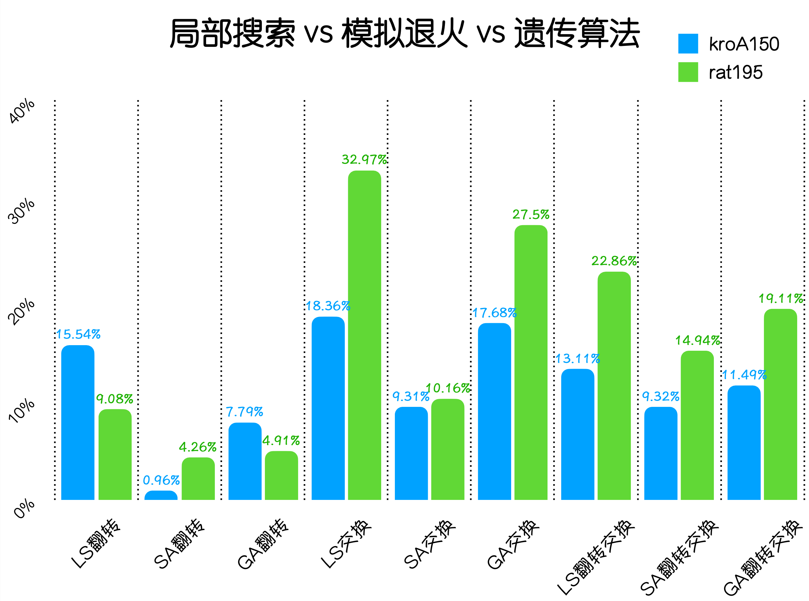

<h1 align=center>实验一实验报告</h1>

<h1 align=center>模拟退火算法与遗传算法</h1>

## 一. 实验要求

> **模拟退火算法：**
>
> 在TSPLIB（http://comopt.ifi.uni-heidelberg.de/software/TSPLIB95/，多个地址有备份；其他网站还可以找到有趣的art TSP和national TSP）中选一个大于100个城市数的TSP问题，
>
> 1. 采用多种邻域操作的局部搜索local search策略求解；
>
> 2. 在局部搜索策略的基础上，加入模拟退火simulated annealing策略，并比较两者的效果；
>
> 3. 要求求得的解不要超过最优值的10％，并能够提供可视化，观察路径的变化和交叉程度。
>
> **遗传算法：**
>
> 用遗传算法求解TSP问题（问题规模等和模拟退火求解TSP实验同），要求：
>
> 1.设计较好的交叉操作，并且引入多种局部搜索操作（可替换通常遗传算法的变异操作）
>
> 2.和之前的模拟退火算法（采用相同的局部搜索操作）进行比较
>
> 3.得出设计高效遗传算法的一些经验，并比较单点搜索和多点搜索的优缺点。

## 二、算法原理

### 1. TSP问题

TSP问题（Travelling Salesman Problem）即旅行商问题，又译为旅行推销员问题、货郎担问题，是数学领域中著名问题之一。假设有一个旅行商人要拜访n个城市，他必须选择所要走的路径，路径的限制是每个城市只能拜访一次，而且最后要回到原来出发的城市。路径的选择目标是要求得的路径路程为所有路径之中的最小值。

TSP问题是一个组合优化问题。该问题可以被证明具有NPC计算复杂性。所有的TSP问题都可以用一个图（Graph）来描述：

- $V=\{c1, c2, …, ci, …, cn\}$，$i = 1,2, …, n$，是所有城市的集合，ci表示第i个城市， n为城市的数目
- $E=\{(r, s): r,s∈ V\}$是所有城市之间连接的集合
- $C = \{c_{rs}: r,s∈ V\}$是所有城市之间连接的成本度量（一般为城市之间的距离）

那么一个TSP问题可以表达为：

求解遍历图$G = (V, E, C)$所有的节点一次并且回到起始节点，并使得连接这些节点的路径成本最低。

### 2. 局部搜索求解

局部搜索是一种局部择优的方法，采用启发式方法，每次从当前解的临近解空间中选择一个最优解作为当前解，直到达到一个局部最优解。

用局部搜索求解的步骤如下：

- 首先随机生成一段遍历所有城市的序列
- 采用某种邻域操作并比较操作前后的总距离，若距离变小则使这个邻域操作生效
- 重复以上过程，直到采用邻域操作后的总距离和之前的差小于某一阀值后停止
- 此时便得到了最优的序列

其中，邻域操作可以有很多种，我使用了如下三种：

- 随机找到一段序列后翻转
- 随机找到两段连续的序列后交换这两段序列的位置
- 随机找到两段连续的序列后将后一段序列翻转并交换这两段序列的位置

### 3. 模拟退火

- 初始化温度 $T_{0,}$ 令当前温度 $T=T_{0}$, 任取初始解
- 对当前解 $S_{1}$ 进行邻域操作，然后产生一个新解 $S_{2}$
- 计算 $S_{2}$ 的增量 $d f=f\left(S_{2}\right)-f\left(S_{1}\right)$
- 若 $d f<0$, 则接受 $S_{2}$ 作为新的当前解; 否则计算 $S_{2}$ 的接受概率 $\exp \left(-\frac{d f}{T}\right)$, 然后产生一个在 $(0,1)$ 区间上均匀分布的随机数 $r a n d$ ，若$\exp \left(-\frac{d f}{T}\right)>\ rand$ 则接受 $S_{2}$ 作为新的当前解 $S_{1}=S_{2}$ ， 否则保留当前解 $S_{1}$ 
- 如果温度低于某一个值则输出当前解 $S_{1}$ 为最优解，程序结束; 否则将温度T乘上退火系数后返回第3步

### 4. 遗传算法

遗传算法是模拟达尔文生物进化论的自然选择和遗传学机理的生物进化过程的计算模型，通过模拟自然进化过程搜索最优解。通常的流程是先建立一个包含潜在的解的群体作为种群，在环境作用下通过选择、交叉和变异一代代繁衍，由于子代的环境适应力一般优于父代，因此算法最终能够得到问题的较优解。

#### ①选择

选择算法是指参照适应值函数，按照预先选定的策略随机从父代中挑选一些个体生存下来，剩下的个体则被淘汰。

这次实验我选择的是轮盘赌选择法。轮盘赌选择法是依据个体的适应度值计算每个个体在子代中出现的概率，并按照此概率随机选择个体构成子代种群。轮盘赌选择策略的出发点是适应度值越好的个体被选择的概率越大，步骤如下：

- 计算群体中每个个体的适应度
- 计算每个个体遗传到下一代的概率
- 计算每个个体的累计概率
- 产生一个[0,1]区间内的随机数，若该随机数小于或等于个体的累积概率且大于个体1的累积概率，选择个体进入子代种群
- 重复上述步骤

#### ② 交叉

交叉是指仿照自然界基因传递的过程交配，对存活下来的父代个体的某些基因进行优化组合，办法是将两个父代个体某些对应位置的基因互换，以产生新的个体。

这次实验我选择的是次序交叉法Order Crossover (OX)：

- 随机选择一对染色体（父代）中几个基因的起止位置
- 生成一个子代，并保证子代中被选中的基因的位置与父代相同
- 先找出第一步选中的基因在另一个父代中的位置，再将其余基因按顺序放入上一步生成的子代中

#### ③ 变异

变异操作我按照要求就是使用各种邻域操作。

## 三、算法实现

### 0. 初始化

- 首先定义一个城市类，用于保存编号及坐标

    ```python
    class city:
        # 初始化城市编号及坐标
        def __init__(self, index, x, y):
            self.cityIndex = index
            self.x = x
            self.y = y
    ```

- 读取tsp文件获取城市信息

    ```python
    cities = []
    # 读取tsp文件初始化城市
    with open("../tc/rat195.tsp") as file:
        cities = []
        begin = False
        for line in file.readlines()[0:-1]:
            # 读取结束
            if line.startswith('EOF'):
                break
            # 跳过开头开始读取
            if line.startswith('NODE_COORD_SECTION'):
                begin = True
            elif begin == True:
                info = re.split('[ ]+', line.strip())
                cities.append(city(info[0], float(info[1]), float(info[2])))
    numOfCity = len(cities)
    ```

- 由于城市间的距离需要反复访问，所以在一开始就计算每两个城市的距离存入表中

    ```python
    # 计算每两个城市的距离
    for i in range(numOfCity):
        dis = []
        for j in range(len(cities)):
            dis.append(int(math.sqrt(math.pow(cities[i].x - cities[j].x, 2) + math.pow(cities[i].y - cities[j].y, 2))))
        distance.append(dis)
    ```

### 1. 局部搜索

- 先随机一条路径并计算当前总距离

    ```python
    path = [i for i in range(numOfCity)]
    random.shuffle(path)
    path.append(path[0])
    # 计算当前的总距离
    dis = 0.0
    for i in range(len(path) - 1):
        dis += distance[path[i]][path[i+1]]
    ```

- 接下来进行邻域操作

    - 随机交换两段序列

        ```python
        first = random.randint(1, len(path)-3)
        second = random.randint(first+1, len(path)-2)
        # 计算总距离的改变
        dE = distance[path[first-1]][path[second]] + distance[path[first]][path[second+1]
                                                                          ] - distance[path[first-1]][path[first]] - distance[path[second]][path[second+1]]
        # 若距离更短则改变有效
        if dE < 0:
            path[first:second+1] = path[second:first-1:-1]
            dis = dis + dE
        ```

    - 随机找到两段连续的序列后交换这两段序列的位置

        ```python
        first = random.randint(1, len(path)-4)
        second = random.randint(first+1, len(path)-3)
        third = random.randint(second+1, len(path)-2)
        dE = distance[path[first-1]][path[second+1]] + distance[path[second]][path[third+1]] + distance[path[third]][path[first]] - distance[path[first-1]][path[first]] - distance[path[second]][path[second+1]] - distance[path[third]][path[third+1]]
        if dE < 0:
            path[first:third+1] = path[second+1:third+1]+path[first:second+1]
            dis = dis + dE
        ```

    - 随机找到两段连续的序列后将后一段序列翻转并交换这两段序列的位置

        ```python
        first = random.randint(1, len(path)-4)
        second = random.randint(first+1, len(path)-3)
        third = random.randint(second+1, len(path)-2)
        dE = distance[path[first-1]][path[third]] + distance[path[second+1]][path[first]] + distance[path[second]][path[third+1]] - distance[path[first-1]][path[first]] - distance[path[second]][path[second+1]] - distance[path[third]][path[third+1]]
        if dE < 0:
            path[first:third+1] = path[third:second:-1]+path[first:second+1]
            dis = dis + dE
        ```

### 2. 模拟退火

大框架与前面一致，只是当新路径距离变大时以接受概率$\exp \left(-\frac{d f}{T}\right)$更新，核心代码如下：

```python
while(T > 0.001):
    for i in range(1000):
        # 邻域操作
        first = random.randint(1, len(path)-3)
        second = random.randint(first+1, len(path)-2)
        dE = distance[path[first-1]][path[second]] + distance[path[first]][path[second+1]] - distance[path[first-1]][path[first]] - distance[path[second]][path[second+1]]
        # 若距离变小直接更新若距离变大则以接受概率更新
        if dE < 0 or random.random() < math.exp(-dE / T):
            path[first:second+1] = path[second:first-1:-1]
            dis = dis + dE
	# 降温
	T *= alpha
```

其中邻域操作与前面一致，便不再叙述

### 3. 遗传算法

- 初始化种群

    我原本是想直接随机生成种群的，但是课上听了同学们的分享之后知道这样会使收敛效果较差，于是采用贪心从而加快成熟速度，每个结点都选择下一个未被加入路径的最近结点

    ```python
    population = []
    individual = [i for i in range(numOfCity)]
    for r in range(int(POP_NUM * 2 / 10)):
        random.shuffle(individual)
        population.append(individual[:])
    for r in range(int(POP_NUM - len(population))):
        start = random.randint(0, numOfCity-1)
        t = []
        t.append(start)
        j = 1
        while j < numOfCity:
            m = float_info.max
            i, best = 0, 0
            while i < numOfCity:
                if (i not in t) and i != t[-1] and distance[t[-1]][i] < m:
                    best = i
                    m = distance[t[-1]][i]
                i += 1
            j = j + 1
            t.append(best)
        population.append(t[:])
    random.shuffle(population)
    ```

- 接下来的主函数核心部分如下：

    ```python
    curGen = 0
    while curGen < MAX_GEN:
        random.shuffle(population)
        # 选择
        population = select(population)
        # 交叉
        population = OX(population, numOfCity)
        # 变异，即局部搜索
        population = localSearch(population, numOfCity)
        population.sort(key=lambda x: calFitness(x))
    ```

- 计算个体适应度，适应度定义为总距离的倒数

    ```python
    def calFitness(individual):
        fitness = 0.0
        for i in range(len(individual) - 1):
            fitness += distance[individual[i]][individual[i+1]]
        fitness += distance[individual[len(individual)-1]][individual[0]]
        return fitness
    ```

- 轮盘赌选择，流程与上面介绍的步骤是一致的

    ```python
    def select(population):
        new = []
        best = float_info.max
        best = 0
        fitness = []
        fitnessTotal = 0.0
        # 计算个体的适应度
        for i in range(POP_NUM):
            fit = calFitness(population[i])
            fitness.append(1 / fit)
            fitnessTotal += 1 / fit
            if (best > fit):
                best = fit
                best = i
        new.append(population[best])
        # 计算累计概率
        p = []
        for i in range(POP_NUM):
            if i == 0:
                p.append(fitness[i] / fitnessTotal)
            else:
                p.append(fitness[i] / fitnessTotal + p[i-1])
        # 轮盘赌选择
        for i in range(POP_NUM-1):
            pro = random.random()
            for j in range(POP_NUM):
                if p[j] >= pro:
                    new.append(population[j])
                    break
        return new
    ```

- 次序交叉

    ```python
    def OX(population, numOfCity):
        sub = []
        for i in range(POP_NUM):
            if random.random() <= p1:
                first = random.randint(0, POP_NUM - 1)
                second = random.randint(0, POP_NUM - 1)
                while first == second:
                    second = random.randint(0, POP_NUM - 1)
                start = random.randint(0, numOfCity - 2)
                end = random.randint(start + 1, numOfCity - 1)
                new1 = []
                new2 = []
                k = 0
                for j in range(numOfCity):
                    if j >= start and j < end:
                        new1.append(population[first][j])
                        j = end
                    else:
                        while k < numOfCity:
                            if population[second][k] not in population[first][start:end]:
                                new1.append(
                                    population[second][k])
                                k += 1
                                break
                            k += 1
                k = 0
                for j in range(numOfCity):
                    if population[second][j] in population[first][start:end]:
                        new2.append(population[second][j])
                    else:
                        if k == start:
                            k = end
                        new2.append(population[first][k])
                        k += 1
                sub.append(new1[:])
                sub.append(new2[:])
        sub.sort(key=lambda x: calFitness(x))
        for i in range(len(sub)):
            for j in range(POP_NUM):
                if calFitness(sub[i]) < calFitness(population[j]):
                    population[j] = sub[i]
                    break
        return population
    ```

- 局部搜索

    - 随机交换两段序列

        ```python
        def localSearch(population, numOfCity):
            for i in range(len(population)):
                if random.random() <= p2:
                    best = population[i][:]
                    for _ in range(100):
                        first = random.randint(1, numOfCity - 2)
                        second = random.randint(first + 1, numOfCity - 1)
                        population[i][first:second] = population[i][second-1:first-1:-1]
                        if calFitness(best) > calFitness(population[i]):
                            best = population[i][:]
                    population[i] = best
            return population
        ```

    - 随机找到两段连续的序列后交换这两段序列的位置

        ```python
        def localSearch(population, numOfCity):
            for i in range(len(population)):
                if random.random() <= p2:
                    best = population[i][:]
                    for _ in range(100):
                        first = random.randint(1, numOfCity - 3)
                        second = random.randint(first + 1, numOfCity - 2)
                        third = random.randint(second + 1, numOfCity - 1)
                        population[i][first:third] = population[i][second +1:third]+population[i][first:second+1]
                        if calFitness(best) > calFitness(population[i]):
                            best = population[i][:]
                    population[i] = best
            return population
        ```

    - 随机找到两段连续的序列后将后一段序列翻转并交换这两段序列的位置

        ```python
        def localSearch(population, numOfCity):
            for i in range(len(population)):
                if random.random() <= p2:
                    best = population[i][:]
                    for _ in range(100):
                        first = random.randint(1, numOfCity - 3)
                        second = random.randint(first + 1, numOfCity - 2)
                        third = random.randint(second + 1, numOfCity - 1)
                        population[i][first:third] = population[i][third - 1:second:-1]+population[i][first:second+1]
                        if calFitness(best) > calFitness(population[i]):
                            best = population[i][:]
                    population[i] = best
            return population
        ```

## 三、实验结果与分析

我使用了kroA150和rat195这两个数据集进行测试，对于三种方法的三种邻域操作在kroA150上的结果图如下所示：

<table frame="void" border=0 > 
    <tr>
        <td>邻域操作</td> 
        <td><p align=center>局部搜索</p></td> 
        <td><p align=center>模拟退火</p></td> 
        <td><p align=center>遗传算法</p></td> 
    </tr>
    <tr>
        <td>翻转</td> 
        <td></td> 
        <td></td> 
        <td></td> 
    </tr>
    <tr>
        <td>交换</td> 
        <td></td> 
        <td></td> 
        <td></td> 
    </tr>
    <tr>
        <td>翻转交换</td> 
        <td></td> 
        <td></td> 
        <td></td> 
    </tr>
</table>

分别计算误差率可得：



从上面的结果图可以得到以下结论：

- 对于三种邻域操作，翻转一段序列的效果最好，将后一段序列翻转并与前一段交换次之
- 对于三种算法，模拟退火是最优的，遗传算法次之，这是因为局部搜索很容易被限制在局部最优，至于遗传算法不如模拟退火的原因可能是交叉算法还不够好；但同时遗传算法的效率也是最低的

以上便是三种算法及三种邻域操作的对比。
