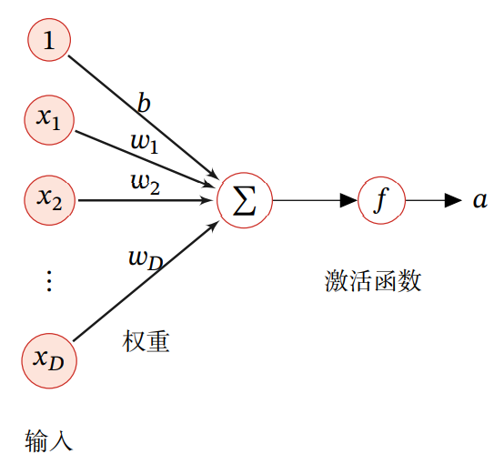
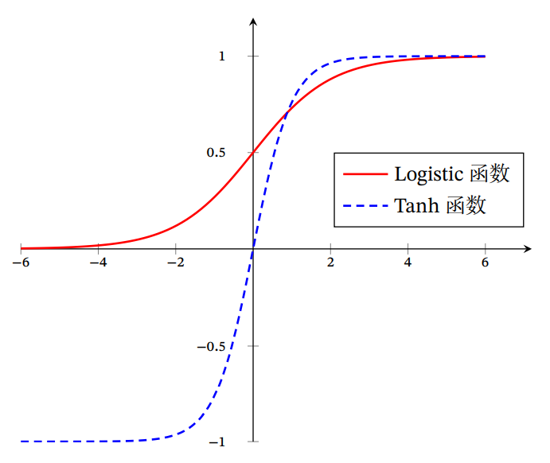
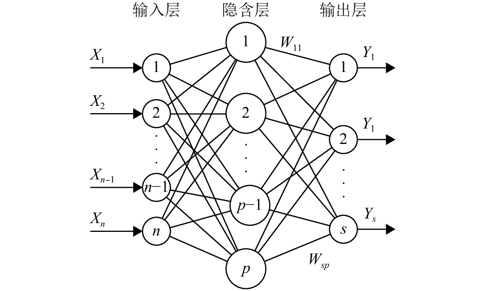
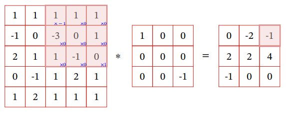
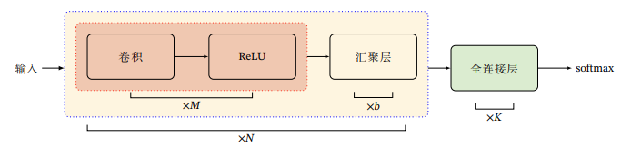
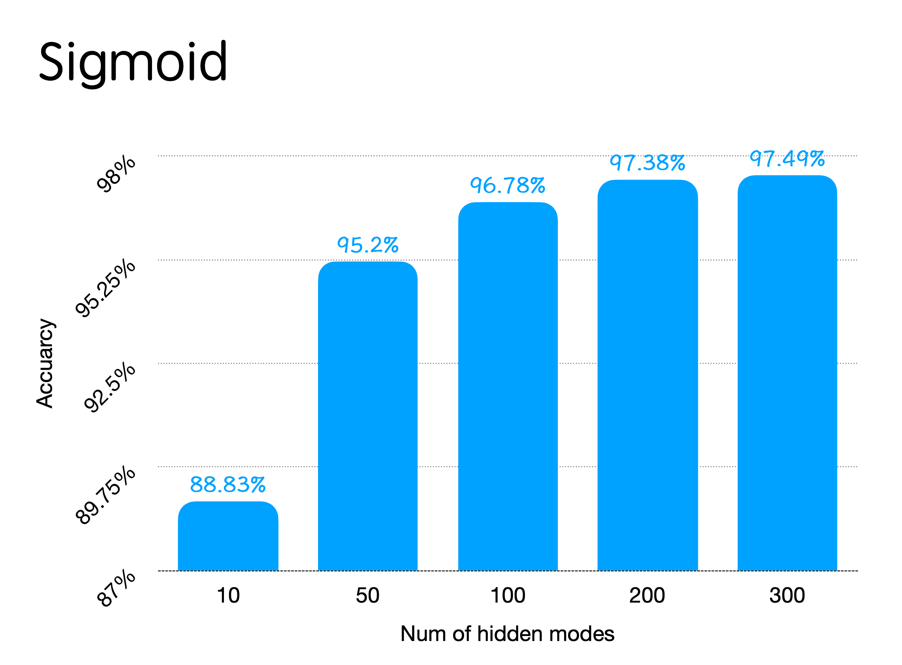
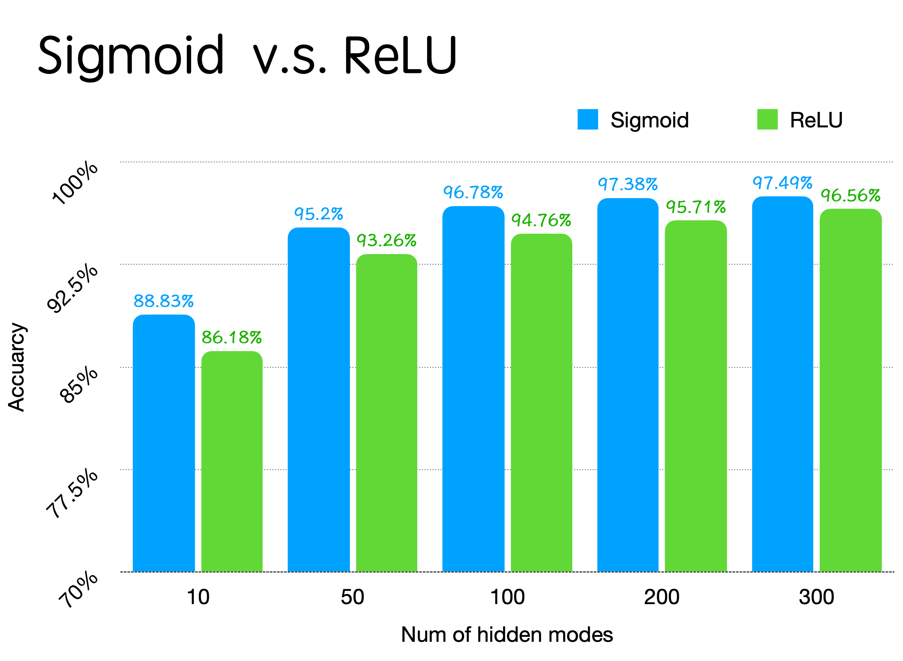
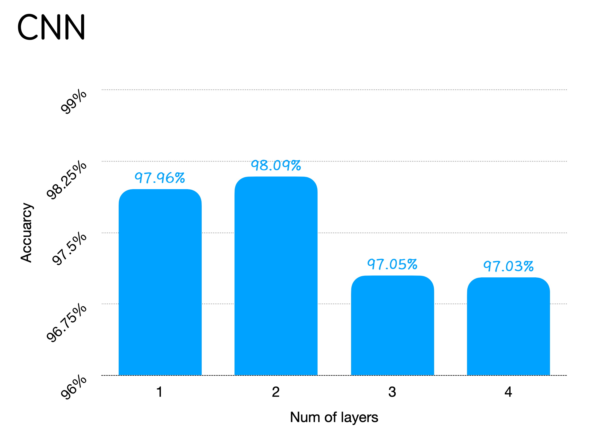

<h1 align=center>实验二实验报告</h1>

<h1 align=center>BP神经网络和卷积神经网络CNN</h1>

## 一. 实验要求

> 构造一个三层的BP神经网络和一个卷积神经网络，完成手写0-9数字的识别：
>
> 1. 设计网络的结构，比如层数，每层的神经元数，单个神经元的输入输出函数；
>
> 2. 根据数字识别的任务，设计网络的输入和输出；
>
> 3. 实现BP网络的错误反传算法，完成神经网络的训练和测试，最终识别率达到70%以上；
>
> 4. 数字识别训练集可以自己手工制作，也可以网上下载，要求具有可视化图形界面，能够输入输出。
>
> 5．进一步的，用**卷积神经网络**实现以上任务，对比深度学习与浅层模型。

## 二. 算法原理

### 1. BP神经网络

神经元是构成神经网络的基本单元，其主要是模拟生物神经元的结构和特性，接收一组输入信号并产生输出。一个典型的神经元如下图所示



其中激活函数是一个连续并可导的非线性函数，给神经网络带来非线性部分。

在这次实验里，我选择了两种激活函数，一个是Sigmoid类函数中的Logistic函数，另外一个是ReLU函数。

Logistic函数方程和导函数方程如下：
$$
\sigma(x)=\frac{1}{1+\exp (-x)}\\
\sigma'(x)=\sigma(x) * (1 - \sigma(x))
$$
当输入值在0附近时，Sigmoid型函数近似为线性函数；当输入值靠近两端时，对输入进行抑制. 输入越小，越接近于0；输入越大，越接近于1。函数图像如下：



ReLU函数方程和导函数方程如下：
$$
\operatorname{ReLU}(x)=\left\{\begin{array}{ll}
x & x \geq 0 \\
0 & x<0
\end{array}\right.  \\
\operatorname{ReLU}'(x)=\left\{\begin{array}{ll}
1 & x \geq 0 \\
0 & x<0
\end{array}\right.
$$
采用 ReLU 的神经元只需要进行加、乘和比较的操作，计算上更加高效。ReLU函数被认为有生物上的解释性，比如单侧抑制、宽兴奋边界。同时采用ReLU的神经网络也有很好的稀疏性。

在这次实验中，我实现了一个三层的BP神经网络，网络架构大致如下：



更新参数的时候我们使用反向传播(即BP算法)。假设损失函数为$\partial \mathcal{L}(\boldsymbol{y}, \hat{\boldsymbol{y}})$，根据链式法则，损失函数相对于神经元权重和偏置的偏导公式为：
$$
\begin{aligned}
&\frac{\partial \mathcal{L}(\boldsymbol{y}, \hat{\boldsymbol{y}})}{\partial w_{i j}^{(l)}}=\frac{\partial \boldsymbol{z}^{(l)}}{\partial w_{i j}^{(l)}} \frac{\partial \mathcal{L}(\boldsymbol{y}, \hat{\boldsymbol{y}})}{\partial \boldsymbol{z}^{(l)}} \\
&\frac{\partial \mathcal{L}(\boldsymbol{y}, \hat{\boldsymbol{y}})}{\partial \boldsymbol{b}^{(l)}}=\frac{\partial \boldsymbol{z}^{(l)}}{\partial \boldsymbol{b}^{(l)}} \frac{\partial \mathcal{L}(\boldsymbol{y}, \hat{\boldsymbol{y}})}{\partial \boldsymbol{z}^{(l)}}
\end{aligned}
$$
由链式法则，令$\boldsymbol{a}^{(l)}$代表每一层的激活值，$\delta^{(l)}$为每一层的误差项，可以得到偏导计算公式如下：
$$
\frac{\partial \mathcal{L}(\boldsymbol{y}, \hat{\boldsymbol{y}})}{\partial \boldsymbol{W}^{(l)}}=\delta^{(l)}\left(\boldsymbol{a}^{(l-1)}\right)^{\mathrm{T}} \\
\frac{\partial \mathcal{L}(\boldsymbol{y}, \hat{\boldsymbol{y}})}{\partial \boldsymbol{b}^{(l)}}=\delta^{(l)}\\
\text{where }\text{ }\delta^{(l)} \triangleq \frac{\partial \mathcal{L}(\boldsymbol{y}, \hat{\boldsymbol{y}})}{\partial \boldsymbol{z}^{(l)}}
$$
激活值和误差项都是可以在前向传播的时候算出来的。更新参数时使用梯度下降优化即可。

在本次实验中我的损失函数为
$$
\frac{1}{2}(\boldsymbol{y} - \hat{\boldsymbol{y}})^2
$$
它的导函数十分简单，就是：
$$
(\boldsymbol{y} - \hat{\boldsymbol{y}})
$$


最后算法伪代码如下：

```
repeat
	for n in 样本数：
		获取样本 x_n, y_n
		前馈计算每一层的激活值a
		反向传播计算误差项delta
		//神经网络的权重为W，偏置为b，学习率为k
		W = W - k (delta * a)
		b = b - k * delta
	end
untill 训练次数结束
```

### 2. CNN卷积神经网络

二维卷积的公式为：
$$
y_{i j}=\sum_{u=1}^{U} \sum_{v=1}^{V} w_{u v} x_{i-u+1, j-v+1}
$$

在图片上的操作如下图所示：



不过这次实验我们直接使用`Pytorch`框架，这些数学式子不需要我实现。

在CNN神经网络里，我们用卷积来代替全连接，这样神经网络会有局部连接和权重共享的特性。此外，我们还会在卷积层之间加上汇聚层，最后还会有全连接层再到输出层。典型的CNN网络模型如下：



## 三、 实现过程

本次实验采用MNIST数据集，像素为28\*28。数据的输入输出就不赘述了，源代码里面有。

### 1. BP神经网络

由于输入图片的像素为28\*28，所以神经网络的输入层有 28\*28 = 784 个节点。而输出层有10个节点，代表该图片对应10个数字的概率。

首先是激活函数的实现，`active_f`是激活函数，`active_f_g`是对应的导函数。

Sigmoid激活函数：

```python
def active_f(x):
    return 1 / (1 + np.exp(-x))
def active_f_g(x):
    return active_f(x) * (1 - active_f(x))
```

ReLU激活函数：

```python
def active_f(x):
    return np.maximum(0, x)
def active_f_g(x):
    return (x >= 0).astype(int)
```

BP神经网络实现如下，包含了前向传播和反向传播过程。

```python
class BP:
    def __init__(self, input_nodes, hidden_nodes, output_nodes, learning_rate):
        #初始化参数
        self.__weight1 = np.random.normal(0.0, pow(hidden_nodes, -0.5), (hidden_nodes, input_nodes))
        self.__weight2 = np.random.normal(0.0, pow(output_nodes, -0.5), (output_nodes, hidden_nodes))
        self.__learning_rate = learning_rate

    def train(self, t_input, t_target):
        #前向过程
        inputs = np.array(t_input, ndmin=2).T
        targets = np.array(t_target, ndmin=2).T
        hidden_inputs = np.dot(self.__weight1, inputs)
        hidden_outputs = active_f(hidden_inputs)
        final_inputs = np.dot(self.__weight2, hidden_outputs)
        final_outputs = active_f(final_inputs)
        
        #计算误差并反向传播
        output_errors = targets - final_outputs
        hidden_errors = np.dot(self.__weight2.T, output_errors)
        self.__weight2 += self.__learning_rate * np.dot((output_errors * active_f_g(final_inputs)),
                                                        np.transpose(hidden_outputs))
        self.__weight1 += self.__learning_rate * np.dot((hidden_errors * active_f_g(hidden_inputs)),
                                                        (np.transpose(inputs)))

    def predict(self, inputs_list):
        #预测过程只需要进行一个前向传播即可
        inputs = np.array(inputs_list, ndmin=2).T
        hidden_inputs = np.dot(self.__weight1, inputs)
        hidden_outputs = active_f(hidden_inputs)
        final_inputs = np.dot(self.__weight2, hidden_outputs)
        final_outputs = active_f(final_inputs)
        return final_outputs
```

主函数训练与预测过程如下：

```python
my_net = BP(784, num_hidden, 10, 0.1)

for _ in range(10):
    for i in range(len(train_images)):
        #调用train进行训练
        my_net.train(train_images[i].reshape(784) / 255 * 0.99 + 0.01, train_labels[i])
acc = []
for i in range(len(test_images)):
    label = np.argmax(my_net.predict(test_images[i].reshape(784) / 255 * 0.99 + 0.01))
    #选取概率最大的数字为输出，若和标签相同则预测成功
    if test_labels[i][label] == 0.99:
        acc.append(1)
    else:
        acc.append(0)
#计算平均准确率
accs.append(np.array(acc).mean())
print("acc is ", np.array(acc).mean(), "when hidden num is ", num_hidden)
```

### 2. CNN卷积神经网络

这次实验我使用的是`Pytorh`的框架，CNN网络结构如图：

```python
class my_CNN(torch.nn.Module):
    def __init__(self):
        super(my_CNN, self).__init__()
        self.conv1 = torch.nn.Sequential(
            # 1通道进 32出 卷积核大小为3*3 卷积核步长1*1
            torch.nn.Conv2d(1, 32, kernel_size=(3, 3), stride=(1, 1)),
            #激活函数
            torch.nn.ReLU(),
            #池化层
            torch.nn.MaxPool2d(kernel_size=(2, 2), stride=(2, 2), dilation=(1, 1))
        )
        self.conv2 = torch.nn.Sequential(
            torch.nn.Conv2d(32, 64, kernel_size=(3, 3), stride=(1, 1), padding=(1, 1)),
            torch.nn.ReLU(),
            torch.nn.MaxPool2d(kernel_size=(2, 2), stride=(2, 2), dilation=(1, 1))
        )
        self.conv3 = torch.nn.Sequential(
            torch.nn.Conv2d(64, 64, kernel_size=(3, 3), stride=(1, 1), padding=(1, 1)),
            torch.nn.ReLU(),
            torch.nn.MaxPool2d(kernel_size=(2, 2), stride=(2, 2), dilation=(1, 1))
        )
        self.dense = torch.nn.Sequential(
            torch.nn.Linear(64 * 3 * 3, 128),
            torch.nn.ReLU(),
            torch.nn.Linear(128, 10)
        )
    def forward(self, x):
        #定义前向过程
        conv1_out = self.conv1(x)
        conv2_out = self.conv2(conv1_out)
        conv3_out = self.conv3(conv2_out)
        res = conv3_out.view(conv3_out.size(0), -1)
        return self.dense(res)
```

Loss函数和优化器分别是交叉熵和Adam优化器。对应代码如下：

```python
my_net = my_CNN()
optimizer = torch.optim.Adam(my_net.parameters())
loss_func = torch.nn.CrossEntropyLoss()
```

输入的数据的形式与CNN是一样的，需要把样本变成框架需要的张量形式。训练过程如下：

```python
for _ in range(1):
    for i in range(len(train_images)):
        #将numpy变成pytorch的Variable，然后输入到网络中
        out = my_net(Variable(torch.reshape(torch.from_numpy(train_images[i] / 255 * 0.99 + 0.01), [1, 1, 28, 28]).to(torch.float32)))
        loss = loss_func(out, Variable(torch.reshape(torch.from_numpy(np.array([np.argmax(train_labels[i])])), [1]).long()))
        optimizer.zero_grad()
        loss.backward()#反向传播
        optimizer.step()#使用优化器优化
```

预测过程如下：

```python
my_net.eval()
acc = []
for i in range(len(test_images)):
    out = my_net(Variable(torch.reshape(torch.from_numpy(test_images[i] / 255 * 0.99 + 0.01), [1, 1, 28, 28]).to(torch.float32)))
    
    #选取概率最大的数字为输出，若和标签相同则预测成功
    label = torch.max(out, 1)[1][0]
    if test_labels[i][label] == 0.99:
        acc.append(1)
    else:
        acc.append(0)
    
#计算平均准确率
print("acc is ", np.array(acc).mean())
```

### 3. 可视化图形界面

我利用PyQt5生成了一个画板并实时显示预测结果。

实现如下：

```python
class Example(QWidget):

    def __init__(self, mynet):
        super(Example, self).__init__()
        self.resize(300, 300)
        self.setWindowTitle("Enter") #画板标题，后面用于输出结果
        self.setMouseTracking(False)
        self.pos_xy = [] #记录画过的轨迹
        self.mynet = mynet #记录训练好的神经网络
        self.button = QPushButton("reset", self) #创建一个重置按钮
        self.button.clicked.connect(self.self_reset) #将重置按钮绑定到重置函数上

    def self_reset(self):
        #重置画板信息
        self.setWindowTitle("Enter")
        self.pos_xy = []
        self.resize(300, 300)
        self.update()

    def paintEvent(self, event):
        #调用接口，将画过的轨迹显示出来
        painter = QPainter()
        painter.begin(self)
        pen = QPen(Qt.black, 2, Qt.SolidLine)
        painter.setPen(pen)
        if len(self.pos_xy) > 1:
            point_start = self.pos_xy[0]
            for pos_tmp in self.pos_xy:
                point_end = pos_tmp

                if point_end == (-1, -1):
                    point_start = (-1, -1)
                    continue
                if point_start == (-1, -1):
                    point_start = point_end
                    continue

                painter.drawLine(point_start[0], point_start[1], point_end[0], point_end[1])
                point_start = point_end
        painter.end()

    def mouseMoveEvent(self, event):
        #将鼠标滑过位置记录下来
        pos_tmp = (event.pos().x(), event.pos().y())
        self.pos_xy.append(pos_tmp)
        self.update()

    def mouseReleaseEvent(self, event):
        #每次松开鼠标，将画过的轨迹进行一次识别
        pos_test = (-1, -1)
        self.pos_xy.append(pos_test)
		
        #将轨迹转换成图片
        img_tmp = np.zeros((28, 28))
        for pos_tmp in self.pos_xy:
            if pos_tmp != (-1, -1):
                tx = int(pos_tmp[1] * 28 / self.size().height())
                ty = int(pos_tmp[0] * 28 / self.size().width())
                img_tmp[tx][ty] = 255
		
        #将预测结果显示到画板标题上
        self.setWindowTitle("%d" % np.argmax(self.mynet.predict(img_tmp.reshape(784) / 255 * 0.99 + 0.01)))
        self.update()
```

## 四、结果分析

### 1. BP神经网络

我分别针对两种激活函数进行测试，分析隐藏层节点数在 `[10, 50, 100, 200, 300]` 的情况下手写数字的识别准确率。

- Sigmoid

  隐藏层节点数与准确率的关系如下图：
  
  
  
- ReLU


将隐藏层节点数与准确率的关系与Sigmoid对比如下：



可以看见当隐藏层节点数越多，识别效果越好。暂时还没有出现过拟合的情况。

另外，我还发现ReLU的学习率不能调太高，否则会出现太多死神经元的情况，导致根本没有识别效果。

### 2. CNN卷积神经网络

针对CNN，我测试的方面主要是网络层数对预测准确率的影响。结果如下图所示：



可以看见当层数变高后准确率有一点降低，出现了一点过拟合的现象。

#### 可视化图形界面结果

可视化图形界面的识别效果一般，主要原因是手写板的二值化图片和MNIST低像素照片风格本来就不是很一样。下面是一些运行截图。识别结果在每张截图上方标题，可以看见截的图的识别结果都是正确的。

<table frame="void" border=0 > 
    <tr>
        <td></td> 
        <td></td> 
        <td></td> 
        <td></td> 
    </tr>
    <tr>
        <td></td> 
        <td></td> 
        <td></td> 
        <td></td> 
    </tr>
    <tr>
        <td></td> 
        <td></td> 
    </tr>
</table>


可以看到只要写的好一点基本上全部数字都能识别出来。