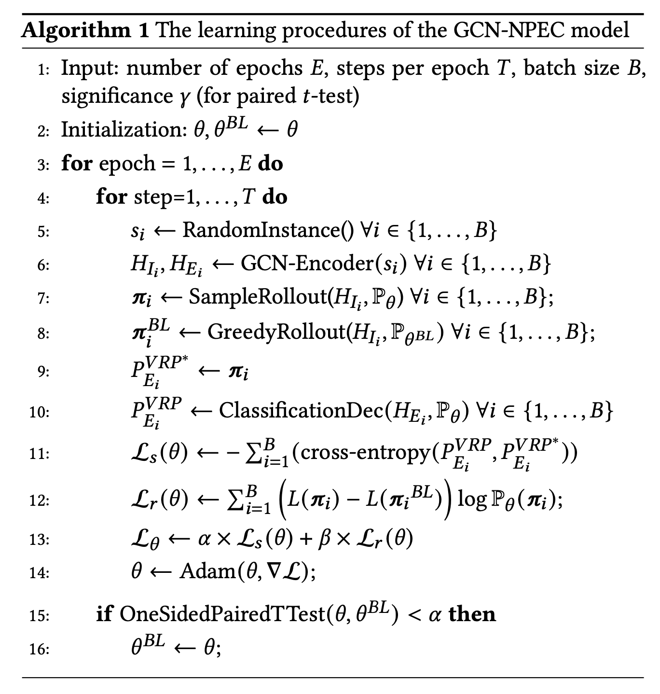

<h1 align=center>实验三实验报告</h1>

<h1 align=center>图神经网络+强化学习</h1>

## 一、实验要求

> 复现以下论文的方法和结果：
>
> Duan,L., Zhan,Y., Hu,H., Gong,Y., Wei,J., Zhang,X., Xu,Y.: Efficiently solving the practical vehicle routing problem: A novel joint learning approach. In: KDD. pp.3054–3063 (2020)
>
> 1．为了节省时间，训练用10个（或以上）的城市规模的算例。测试算例用20个（或者以上）规模。
>
> 2．显示出算法训练收敛过程，可视化最后的解。可能的情况下，对比OR-Tools的求解效果（后面详细描述）。

## 二、导言

车辆路径规划问题（VRP）是运筹优化领域最经典的优化问题之一。在此问题中，有若干个客户对某种货物有一定量的需求，车辆可以从仓库取货之后配送到客户手中。客户点与仓库点组成了一个配送网络，车辆可以在此网络中移动从而完成配送任务。在求解此问题过程中，需要优化的决策变量为每个客户的配送任务应该分配到哪一辆车上，以及每辆车完成客户配送任务的先后顺序，优化目标为最小化车辆总行驶距离和使用的车辆数。

故核心优化的目标为车辆总的固定成本 + 运输成本，VRP问题最简单的形式就是使车辆具有容量的约束（装载量有限）。每辆车从给定的节点出发和返回，优化的目标就是车辆相关费用和配送距离的函数。目前的研究工作分为两个流派：一种是通过运筹学，另一种是深度学习。运筹学的方法是把VRP定义为数学优化问题，通过精确或启发式算法达到最优或者近似最优解，但是真实场景的数据量下需要花费的时间很多。而对于深度学习，之前的研究是在人工生成的数据集上，忽略了真实世界的运输网络。在真实VRP问题数据集上，没有一个方法能比得上OR-tools，于是便想着提出一种新的方法。

## 三、算法流程

> 这里主要是将论文中的算法结合我自己的理解再描述一遍

### 1. Problem Setup: Graph Optimization Perspective

首先从图优化的视角来形式化的描述以下VRP问题。 一个VRP实例，可以看做一张图 $G=(V, E)$ ，其中顶点集合: $V=\{0, \ldots, n\}$, 其中 $i=0$ 表示depot, $i=1, \ldots, n$ 表示客户，边集合: $\quad E=\left\{e_{i j}\right\}, i, j \in V$。

depot节点只有坐标特征 $x_{0}^{c}$ ，而其他客户节点有坐标特征和需求量特征，因此是一个二维特征向量 $x_{i}=\left\{x_{i}^{c}, x_{i}^{d}\right\}$，其中$ x_{i}^{c}, x_{i}^{d}$ 分别是坐标特征和需求量特征。每条边关联两个节点之间的距离为 $m_{i j}$ 。

假设有： VRP是生成一个tour集合，每个tour代表了一个车辆的路径，从节点0出发，在节点0结束，每个客户被服务一次且仅一次，每辆车的负载不超过它本身的容量，目标是最小化总体花费。

那么，模型的目标是生成一个客户的序列: $\pi=\left(\pi_{1}, \pi_{2}, \pi_{3}, \ldots, \pi_{T}\right)$ 其中, $\pi_{t} \in\{0,1, \ldots, n\}$, 并且 $\pi_{0}$ 可以出现多次，其他节点只能出现一次。因此，每两个 $\pi_{0}$ 之间的序列就是一辆车的路线。模型目标如下：
$$
\min c_{v} Q_{v}+c_{t} \sum_{t=1}^{T-1} m_{\pi_{t} \pi_{t+1}}
$$
其中 $c_{v}$ 是每辆车的固定费用, $Q_{v}$ 是使用的车辆数, $c_{t}$ 是行驶的单位消耗。

### 2. Graph Convolutional Networks with Node Sequential Prediction and Edge Classification

模型整体架构如下图（摘自论文）：

可以看出整体的模型是GCN模型（graph convolutional networks）以及两个单独的decoder。其中一个是sequential prediction decoder，基于RNN，用node embedding作为输入，输出一个序列，作为VRP实例的一个解；另一个是classification decoder，基于MLP，输入edge embedding，输出一个概率矩阵，矩阵元素的值代表了边出现在车辆路径中的概率，当然也可以根据这个概率矩阵转化成VRP实例的解。同时将sequential prediction decoder的输出当作classification decoder输出的label，学习两个decoder的时候可以相互促进。用强化学习的方式来训练sequential prediction decoder，然后用监督学习的方式做策略采样，是为了训练classification decoder。最后，为了训练完整的模型，使用了一种结合的策略在可接受的时间内返回高质量的解。

#### ① 输入

给定VRP实例的图 $\mathbb{G}=(\mathcal{V}, \mathcal{E})$, 除了depot, 每个节点 $i \in \mathcal{V} \backslash\{0\}$的输入是需求和坐标，节点depot 0 只有坐标信息。它们通过一个Relu全联接网络， 初始化为一个 $d_{x}$ 维的特征向量。
$$
x_{i}=\left\{\begin{array}{l}
\operatorname{Relu}\left(W_{1} x_{c_{0}}+b_{1}\right), \quad \text { if } i=0, \\
\operatorname{Relu}\left(\left[W_{2} x_{i}^{c}+b_{1} ; W_{3} x_{i}^{d}+b_{2}\right]\right), \text { if } i \geq 0
\end{array}\right.
$$
其中, $[;]$ 是concat操作。 $W_{1}, W_{2}, W_{3}, b_{1}, b_{2}, b_{3}$ 是可训练的参数。 对每个 $e_{i j} \in E ，$ 边上的特征 $y_{i j}$ 是跟节点 $(i, j)$ 之间的邻接关系和距离相关的。尽管 $G$ 是全连接的， 仍然会定义邻接矩阵 $A \in R^{(n+1) \times(n+1)}:$
$$
a_{i j}=\left\{\begin{array}{l}
1, \text { if } i \text { and } j \text { are } k-\text { nearest neighbors } \\
-1, \text { if } i=j \\
0, \text { others }
\end{array}\right.
$$
因此，如果 $i$ 和 $j$ 是 $k$ 近邻 (本文 $k=10$ )，那么他们就是邻接的，否则就不邻接。同时，用-1表示自连接。同样，边特征 $y_{i j}$ 初始化为 $d_{y}$ 维的特征：
$$
y_{i j}=\operatorname{Relu}\left(\left[W_{4} m_{i j}+b_{4} ; W_{5} a_{i j}+b_{5}\right]\right)
$$
其中 $W_{4}, W_{5}, b_{4}, b_{5}$ 是可训练的参数。 

#### ② GCN Encoder

给定 $d_{x}$ 维的节点特征 $x_{i}$ 和 $d_{y}$ 维的边特征 $y_{i j}$, encoder首先分别计算出 $d_{h}$ 维的节点和边的embedding , 记做 $h_{i}^{0}$ 和 $h_{e_{i j}}^{0}$, 用到的线性映射的参数分别为 $W_{E 1}, W_{E 2}, b_{E 1}, b_{E 2}$ 。
$$
\begin{array}{r}
h_{i}^{0}=W_{E 1} x_{i}+b_{E 1} \\
h_{e_{i j}}^{0}=W_{E 2} y_{i j}+b_{E 2} .
\end{array}
$$
然后这些embedding会通过一个 $L$ 层的图卷积 $(G C)$ 层, 每一层包含两个子层： aggregation和combination。

在一个标准的 $L$ 层GCN中，每一层 $l(l=1,2, \ldots, L) \quad$都有aggregation和combination两个子层。通过 $l$ 层之后的节点embedding定义如下：
$$
\begin{array}{c}
h_{N(i)}^{\ell}=\sigma\left(W^{\ell} A G G\left(\left\{h_{i^{\prime}}^{\ell-1}, \forall i^{\prime} \in N(i)\right\}\right)\right) \\
h_{i}^{\ell}=C O M B I N E\left(h_{i}^{\ell-1}, h_{N(i)}^{\ell}\right)
\end{array}
$$
其中, $h_{N(i)}^{l}$ 表示节点 $i$ 邻接节点的聚合特征, $N(i)$ 表示节点 $i$ 的邻接节点。 $A G G$ 是一个 聚合函数，可定制，例如max-pooling, mean-pooling, 或者基于注意力的加权求和。 $W^{l}$ 是 可训练的矩阵，被第 $l$ 层上所有节点共享。 $\sigma$ 是一个非线性激活函数，例如Relu。 $C O M B I N E$ 是一个组合自身embedding和邻接节点聚合embedding的函数，同样是可定制的，例如 GraphSAGE中用的concat函数。 在本文中，考虑到VRP的图，作者改造了标准的 $\mathrm{GCN}$ 。标准的GCN把所有节点看作一样的，没有边特征。而这里的GCN同时输入了节点和边特征，并且同时更新他们。

##### Aggregation sub-layer

对于两个子层，首先是**Aggregation sub-layer**，对于节点 $v_{i} \in V$ ，具体的节点聚合embedding $h_{N(i)}^{l}$ 如下:
$$
h_{N(i)}^{\ell}=\sigma\left(W_{I}^{\ell} A G G_{I}^{\ell}\left(A T T N\left(h_{i}^{\ell-1},\left\{h_{v r}^{\ell-1}, \forall v, \in N(i)\right\}\right)\right)\right.
$$
其中, $W_{I}^{l}$ 是可训练参数, $A T T N$ 是一个函数： $f: h_{\text {key }} \times H_{\text {val }} \rightarrow h_{v a l}$, 把特征向量 $h_{k e y}$ 和候选特征向量集合 $H_{v a l}$ 映射到一个特征向量的加权和。attention的权重可以是scaled dotproduct attention。 对于边 $e_{i j} \in E$ ，考虑这条边连接的两个节点。因此, 这条边的聚合embedding $h_{N\left(e_{i j}\right)}^{l}$ 可 以定义为：
$$
\begin{array}{c}
h_{N\left(e_{i j}\right)}^{\ell}=\sigma\left(W_{E}^{\ell} A G G_{E}^{\ell}\left(\left\{h_{e_{i j}}^{\ell-1}, h_{i}^{\ell-1}, h_{j}^{\ell-1}\right)\right)\right. \\
A G G_{E}^{\ell}\left(\left\{h_{e_{i j}}^{\ell-1}, h_{i}^{\ell-1}, h_{j}^{\ell-1}\right)=W_{e 1}^{\ell} h_{e_{i j}}^{\ell}+W_{e 2}^{\ell} h_{i}^{\ell}+W_{e 3}^{\ell} h_{j}^{\ell}\right.
\end{array}
$$
其中, $\quad W_{E}^{l}, W_{e 1}^{l}, W_{e 2}^{l}, W_{e 3}^{l}$ 都是可训练参数。

##### Combination sub-layer

接下来是**Combination sub-layer**。在得到了聚合embedding之后，可以按如下策略定义组合子层：
$$
\begin{array}{c}
h_{i}^{\ell}=\left[V_{I}^{\ell} h_{i}^{\ell-1} ; h_{N(i)}^{\ell}\right] \\
h_{e_{i j}}^{\ell}=\left[V_{E}^{\ell} h_{e_{i j}}^{\ell-1} ; h_{N\left(e_{i j}\right)}^{\ell}\right]
\end{array}
$$
其中, $V_{I}^{l}$ 和 $V_{E}^{l}$ 分别是节点和边的可训练的权重矩阵。 $h_{i}^{l}$ 和 $h_{e_{i j}}^{l}$ 是节点和边在第 $l$ 层的隐状态。另外，这些可训练的参数每层都是单独的。还有，每个子层会增加一 个skip-connection和layer normalization操作。

#### ③ The Decoders

得到了GCN的编码embedding之后，作者提出了两个网络独立的decode它们。

##### Sequential prediction decoder

用GRU和基于上下文的attention机制，将节点embedding映射成一个序列 $\pi$ 。之所以选用序列模型而不是self-attention机制，是因为序列的解严重依赖前序的步骤。 给定任意一个输入 $S$, 该过程会生成一个长度为 $T$ 的序列，$\pi=\left\{\pi_{t}, t=1, \ldots, T\right\}$ ， 长度有可能超过n+1，因为depot节点可能会出现多次。同时也可以用符号 $\pi_{t}$ 表示时间步 $t$ 时刻已生成的序列。我们便希望找到一个随机策略 $p(\pi \mid S ; \theta)$ ，可以生成一个序列 $\pi$, 最小化目标。这个随机策略是一个联合概率，根据链式法则可以分解如下:
$$
\begin{equation}
\begin{aligned}
P(\boldsymbol{\pi} \mid s ; \theta) &=\prod_{t=0}^{T} p\left(\pi_{t+1} \mid S, \pi_{t} ; \theta\right) \\
&=\prod_{t=0}^{T} p\left(\pi_{t+1} \mid f\left(S, \theta_{e}\right), \pi_{t} ; \theta_{d}\right)
\end{aligned}
\end{equation}
$$

其中, $f\left(S ; \theta_{e}\right)$ 是编码器, $\theta_{d}$ 是可训练的参数。这里用一个GRU单元，通过引入一个状 态向量 $z_{t}$ 来估计最后一项， embeds了已生成的序列 $\pi_{t-1}$ ，例如:
$$
p\left(\pi_{t} \mid f\left(S, \theta_{e}\right), \boldsymbol{\pi}_{t-1} ; \theta_{d}\right)=p\left(\pi_{t} \mid f\left(S, \theta_{e}\right), z_{t} ; \theta_{d}\right) .
$$
解码过程也是序列的，在decode时间步 $t \in\{1, \ldots, T\}$, 序列decoder根据GCN生成的节点 embedding和GRU的隐状态 $z_{t}$ 来生成节点 $\pi_{t} 。$ 具体的方法是 $p\left(\pi_{t} \mid z_{t}, f\left(S, u ; \theta_{e}\right) ; \theta_{d}\right)$ 通过一 个特殊的attention机制：Pointer网络，它会跟encode网络中的每一个节点计算一个attention score, 然后经过softmax来得到概率分布。它允许decoder随时查看整个图 $G(V, E)$, 并且最终选中一个输入节点作为最终的输出 $\pi$ 。 为了符号方便，假设 $h_{i}^{L}$ 是embeded好的输入。在decode的时间步 $t$, 节点 $i$ 的上下文权重 $u_{t i}$ 计算方法如下：
$$
u_{t i}=\left\{\begin{array}{ll}
-\infty, & \forall j \in N_{m t} \\
h_{a}^{T} \tanh \left(W^{G}\left[v_{i} ; z_{t}\right]\right), & \text { otherwise }
\end{array}\right.
$$
其中, $N_{m t}$ 是时间步 $t$ 时刻mask住的节点集合。 $h_{a}^{T} \in R^{d_{h}}, \quad W^{G} \in R^{1 \times 2}$ 是参数。注意到，在开始计算上下文attention之前，有一个将时间步 $t$ 时刻不可用的节点mask掉的过程。 mask的规则跟问题的约束有关。 在VRP问题中，每辆车的容量 $c>0$, 每个节点有各自的需求量 $x_{i}^{d}$, 假设 $0<x_{i}^{d}<c, \forall i \in\{1,2, \ldots, N\}$, 并且 $x_{0}^{d}=0$ 。有一个可行性的约束, 就是每条线路的需求量, 不能超过车的容量，也就是说 $\sum_{i \in R_{j}} x_{i}^{d}<c$, 其中, $R_{j}$ 是路径 $j$ 上的节点集合。 为了满足容量约束，始终关注每个节点在时间步 $t$ 尚未满足的需求 $x_{i}^{d}, i \in\{1, \ldots, N\}$ 和 车辆的剩余容量 $\tilde{c_{t}}$ 。如果一个节点遍历过了, 设 $\tilde{x}_{i}^{d}=0$ 。剩余容量更新如下:
$$
\tilde{c}_{t}=\left\{\begin{array}{ll}
c, & \pi_{t}=0 . \\
\max \left(0, \tilde{c}_{t-1}-x_{\pi_{t}}^{d}\right), & \pi_{t} \neq 0
\end{array}\right.
$$
另外，在时间步 $t$ ，不允许节点的需求量超过车辆的剩余装载量。也不允许depot出现在两个相邻的时间步中，因此，得出了如下的mask节点的方法：
$$
N_{m t}=\left\{\begin{array}{ll}
N_{m(t-1)} \cup\{0\} & \pi_{t-1}=0 \text { or } t=1 \\
\cup\left\{i \mid \tilde{x}_{i}^{d}=0 \text { or } \tilde{x}_{i}^{d} \geq \tilde{c}_{t}\right\}, & \text { others }
\end{array}\right.
$$
然后用softmax函数得出指向输入节点的分布：
$$
p\left(\pi_{t} \mid f\left(S, \theta_{e}\right), \pi_{t-1} ; \theta_{d}\right)=\operatorname{softmax}\left(u_{t i}\right), j \in\{1, \ldots, N\}
$$
##### Classification decoder

之前有工作利用GCN和边embedding特征，并且利用最优解作为label来解决TSP问题。但是这里的场景并不适用，因为目标是解决大数据量的真实VRP问题，最优解很难给出来。 由此也促使作者想出一个新方法。从直觉看，由于节点embedding和边embedding都包含了图 的信息，并且相互影响，因此从序列decoder得出的解和分类器decoder得出的解应该一致才符合逻辑，当方法收敘的时候。因此，作者把序列decoder得出的解 $\pi$ 作为分类器decoder的 监督label。另外，一个节点的序列可以唯一转化为一条车辆路径上边的序列。例如，序列 $\{0,4,5,1,0,2,3,0\}$ 对应着边的集合 $\left\{e_{04}, e_{45}, e_{51}, e_{10}, e_{02}, e_{23}, e_{30}\right\}$ 。不论是节点序列还是边序列，都可以表示VRP实例的一个解。假设出现在车辆路径上的边权重为1，未出现的为0，便可以获得一个0-1矩阵，对应着一个序列，使得 $P_{E}^{V R P^{*}}=\left\{p_{e_{i j}}^{V R^{*}}\right\} e_{i j} \in E$。
把 $P_{E}^{V R P^{*}}$ 作为label，然后把边embedding的GCN最后一层输出 $h_{e_{i j}}^{L}$ 经过一个MLP, 然 后获得一个softmax分布，可以看作边 $e_{i j}$ 出现的概率。形式化的表示就是：
$$
p_{e_{i j}}^{\mathrm{VRP}}=\operatorname{softmax}\left(M L P\left(h_{e_{i j}}^{L}\right)\right) \in[0,1]^{2}
$$
在下文中，作者用 $P_{E}^{V R P}$ 来表示MLP得到的概率矩阵。这个输出需要尽可能接近 $P_{E}^{V R P^{*}}$ 。 该架构可以通过一个预测精准的序列，使得分类器decoder得到提升。反过来，利用提升的边特征，可以是的序列decoder效果更好，从而形成良性循环。 

#### ④A Joint Learning Strategy

上述模型结合了强化学习和监督学习。为了训练它，同样需要两者结合的策略。 

##### REINFORCE with rollout baseline

首先把reinforced损失作为期望损失： $L_{r}\left(\theta_{e}, \theta_{d} \mid S\right)=E_{P\left(\pi \mid f\left(S ; \theta_{e}\right) ; \theta_{d}\right)} L(\pi)$ ， 其中 $L(\pi)$是解 $\pi$ 的整体cost。作者使用带有baseline $b(S)$ 的REINFORCE算法来训练策略。损失函数推导如下：
$$
\begin{equation}
\begin{aligned}
\mathcal{L}_{r}\left(\theta_{e}, \theta_{d}\right) &=\sum_{S} \mathbb{E}_{\boldsymbol{\pi} \sim P\left(\boldsymbol{\pi} \mid S ; \theta_{e}, \theta_{d}\right)}(L(\boldsymbol{\pi})-b(s)) \\
&=\sum_{S}(L(\boldsymbol{\pi})-b(S)) \sum_{i=1}^{T} \log p\left(\pi_{i} \mid \boldsymbol{\pi}_{i-1}, S ; \theta_{e}, \theta_{d}\right)
\end{aligned}
\end{equation}
$$

##### SUPERVISE with policy-sampling

根据上文所述，分类器decoder的损失函数如下:
$$
\mathcal{L}_{s}\left(\theta_{e}, \theta_{c}\right)=-\sum_{S, \boldsymbol{\pi}} \text { crossEntropy }\left(P_{E}^{V R P}, P_{E}^{\mathrm{VRP}^{\star}}\right)
$$
其中, $\theta_{c}$ 是可训练参数，为了结合REINFORCE和SUPERVISE，可以简单地把二者的损失函数做线性组合，最终的损失函数如下:
$$
\mathcal{L}_{\boldsymbol{\theta}}=\alpha \times \mathcal{L}_{s}(\boldsymbol{\theta})+\beta \times \mathcal{L}_{r}(\boldsymbol{\theta})
$$
## 四、代码实现

首先，整个算法的流程如论文中的算法流程一致，如下：（摘自论文）

首先, 定义一个baseline策略 $P_{\theta^{B L}}$ 作为训练策略 $P_{\theta}$, 在训练过程中，模型在不断变化, 但是baseline策略会冻结一定数量的steps（每个epoch) 直到效果显著提升（配对样本 $T$ 检验的 $\gamma=5 \%$ ) 。第6行是通过GCN编码器生成节点embedding $H_{I_{i}}$ 和边embedding $H_{E_{i}}$ 。然后用序列预测 decoder将节点embedding $H_{I_{i}}$, 通过两个策略 $P_{\theta}$ 和 $P_{\theta^{B L}}$ 输出两个解： $\pi_{i}$, $\pi_{i}^{B L}$ 。第9行是把解 $\pi_{i}$ 转化成0-1矩阵作为分类器decoder的label。

我们在复现的时候主要也是参考了助教所给出的代码，最终完成了复现。

## 四、实验结果

我们使用G-20数据集训练10轮，最终结果图如下：

因为训练一轮的时间过久，我们只训练了10轮，所以现在的结果可能还并不是很好。

loss结果如下：

由于这里的loss为访问当前客户行驶的路径长度的**负值** ，所以不断增长代表着路径长度在不断减小，所以路径总长度是在不断减小的。
